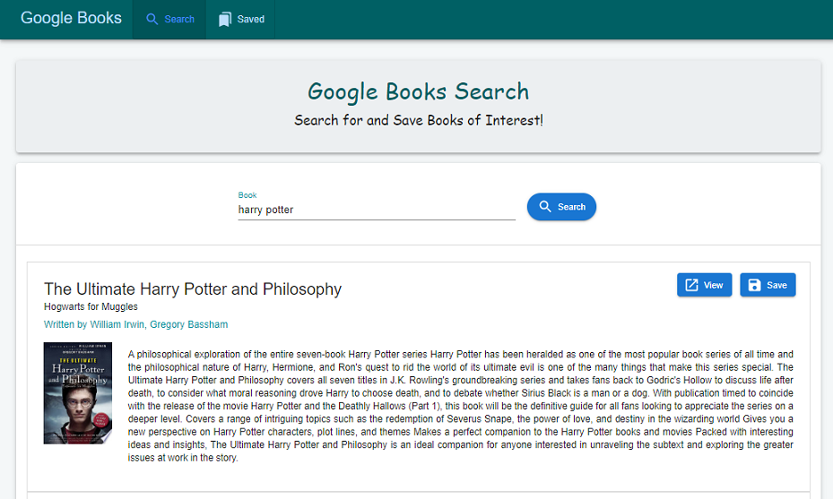
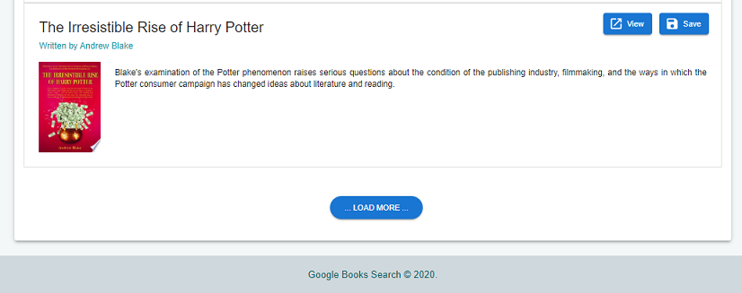
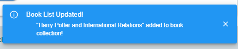
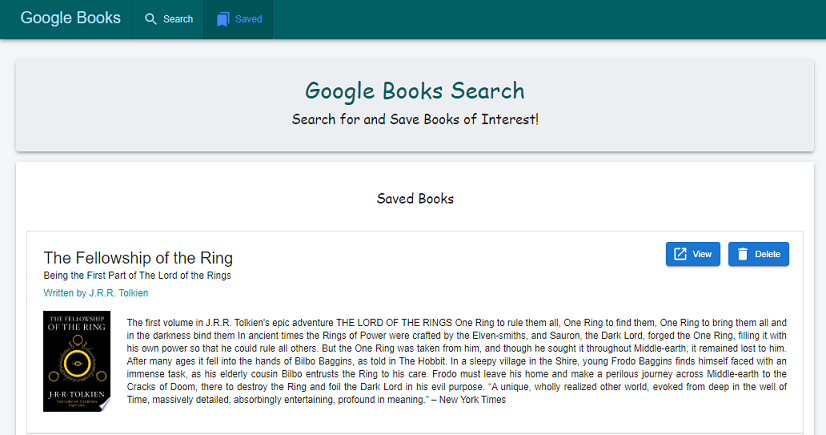

# Google Books Search

## Description 
 

  

The Google Books Search application lets users search for and browse books they like from google. They can then choose to save it into a shared booklist and review or purchase them later. When a book is added or removed from the booklist, all users in the system get a notification.  

Deployed Application: [https://gveetil-books-search.herokuapp.com/](https://gveetil-books-search.herokuapp.com/)
  

## Table of Contents 

- [Technical Features](#technical-features)
 - [MERN Stack](#mern-stack)
 - [Heroku Deployment](#heroku-deployment)
 - [Infinite Scroll](#infinite-scroll)
 - [Push Notifications](push-notifications)
 - [Responsive Web Design](#responsive-web-design)
- [Usage Guidelines](#usage-guidelines)
- [Known Issues](#known-issues)
  

## Technical Features

### MERN Stack
This application is developed using the MERN stack- It uses React and Material UI for the front end; The backend is powered by Node.js with express server, mongo as the database, and mongoose as the ORM. It also uses the google books API to fetch data, and socket-io for sending push notification messages. 

### Heroku Deployment
The application is currently deployed on Heroku and uses mLab to host the backend mongo database. 

### Infinite Scroll
The search page loads 10 books by default, and has a `load more` button that the user can use to load more books dynamically. The infinite scroll has been implemented via a custom built react hook.  

### Push Notifications
When a book is saved into the book collection, or if a book is deleted from the saved books, the server sends a push notification to all users who are currently accessing the system. This notifies them of the action performed and the title of the book updated. This has been achieved via the use of the socket.io package.

### Responsive Web Design 
This application is built using Responsive web design principles. To achieve this, I have used the Material UI component library with styling to ensure pages render on all screen sizes.

## Usage Guidelines

When the Google Books Search application is opened, it displays the below page:  

  

* To search for a book, enter the name of the book and click search. 
* This will perform a google books search and display all records that match your search query.
* By default 10 books will be displayed - to view more books, scroll to the end of the page and click the `load more` button:  

  

* This will show 10 additional books - the load more can be performed repeatedly until we reach the end of the results. 
* To View book details directly on Google, click on the View button, or the book image link.
* To Save a book to the booklist , click on the Save button. If the book has already been saved to the book list, then a message is displayed.
* When a book is saved to the book list, the server sends a push notification to all connected users. This is displayed as below:  

  

* To view the saved books, click the Saved Books link from the navigation titlebar. This brings up the list of books saved to the book list:

  

* To View book details directly on Google, click on the View button, or the book image link.
* To remove a book form the saved list, click on the delete button. The server will then delete the book from the list and then send a push notification to all connected users.

## Known Issues

The application currently displays only one push notification per user to keep it more manageable. This means that the older notifications get overwritten when a new notification is recieved. 